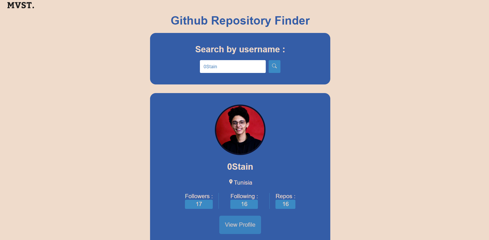

# Github Repositories Search Application

## About the company : **MVST.**

We work together to design, develop and create outstanding digital products that we are proud of, for companies that we believe in.


## Description

This project's objective is to fetch Github repositories from specific users and be able to search/filter through them by name.

### Installation

* Clone the repositore using **git clone https://github.com/0Stain/gitRepos--MVST**

Run these commands in order

``` bash
npm install
npm start
```
Run on **localhost/3000**

## **Live App**

**https://64190c4bae9b9d00081be46d--gitrepos-mvst-0stain.netlify.app**

## Tech Stack

**React TypeScript**

## *Screenshots*




## **Future Improvements**

* Implement testing
* More functionalities (other search filters, by programming language...)
* Better Styling
* More developped(Follow button, login button, star button,...)


## Author 
**Louay Jeddou - [@0Stain](https://github.com/0Stain)**

*louay.jeddou@esprit.tn*
